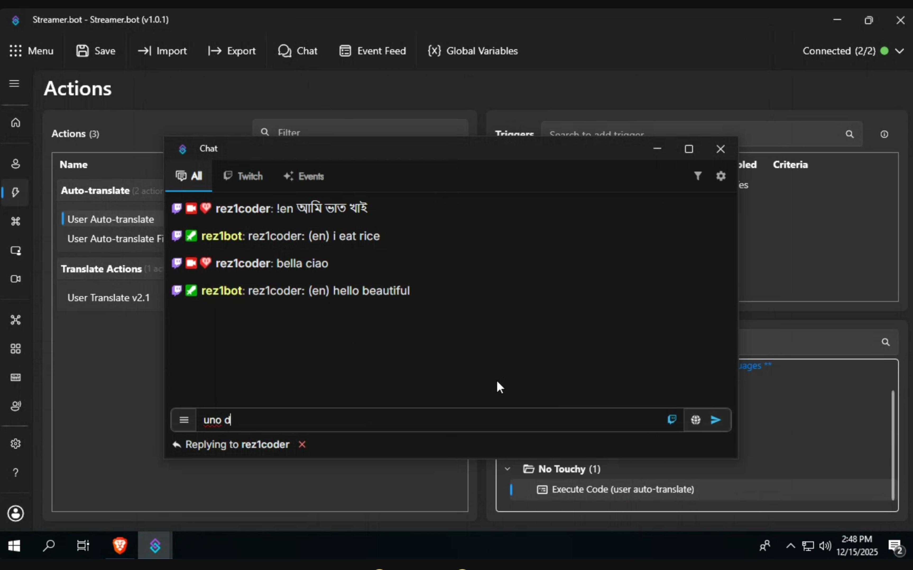

## Overview
This is a Twitch chat translator for [Streamer.bot](www.streamer.bot). It supports two translation methods:

- Translate by command
- Auto-translate

You can use either or both.

## Key Features
- Translate by typing or replying to a message
- Uses Google Translate API with UTF-8 Encoding
- No API keys and no token limits
- Translation message starts with `rez1: (en)` as in `user: (toLanguage)`
- Replies retain the original user as the author, not the one who typed `!en`
- Translations over 500 characters will be split into multiple messages
- Handles HTTP request timeouts
- A quick tutorial is sent to the user if no text is detected

## How to use

Type `!en [text]` or reply to a message with `!en`

> [!NOTE]
> You can modify the commands/codes if you want (e.g. `!t` )

## Language Arguments
You can set your own language using [language codes](https://cloud.google.com/translate/docs/languages).
-   **fromLanguage** default is `auto`
-   **toLanguage** default is `en` (English)

## Installation
- Open the Import dialog in Streamer.bot
- Drag and drop the downloaded `.sb` file into the `Import String` box
- Enable the `User Translate` action and command if needed
- Done

> [!IMPORTANT]
> For auto-translate, you must connect your Twitch bot account.

## Demo
